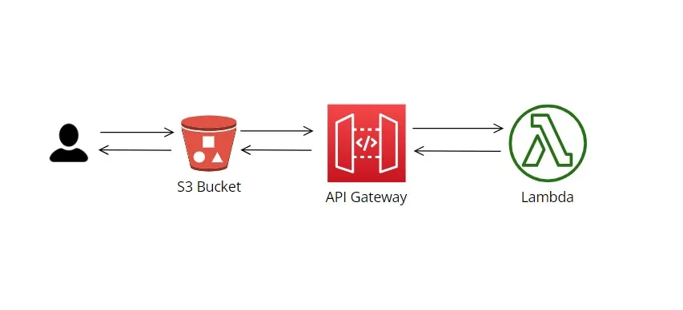
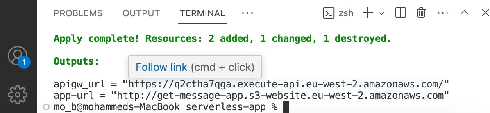

# serverless-app

 
this is the infrastructure I created..

Building a serverless computing model allows you not to manage servers which the effort can be redirected to writing, deploing code or applicatisons without the need of handling the underlying infrastructure.

This serverless web app is a simple HTML website build and hosted on a serverless. The advatanges is that it offers a flexbile, cost-effective and developer-friendly approach to creating and host a web-app. They suited for well-suited for various workloads, rapid developement ctyle and automatic scaling.

Here I used  Terraform , a popular (IaC) tool for deplying the infrastructure.

Prerequisites:
Before getting started, make sure you have the following:

• An AWS account
• AWS CLI  and Terraform installed and configured on your local machine 
An AWS account
• Sample backend code using of the AWS Lambda-supported languages in this case - python.

Steps to build the infrastrcuture on AWS using Terraform:
• Configure Provider using Terraform
• Setting up your AWS Lambda Function
• Creating an API Gateway
• Create the S3 bucket to host the HTML website in S3.
• Access the website using the output I created using for the API Gateway.

After Terraform Init, Plan and Apply. This is the image I recived and the bottom link takes you here.

